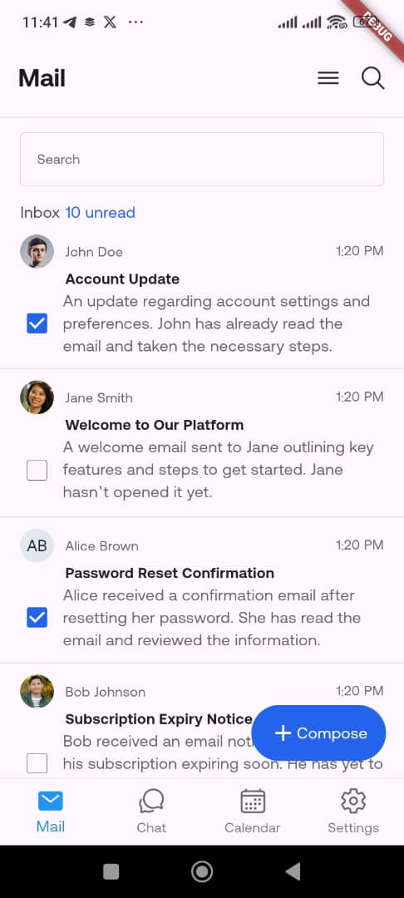

# flutter_project

A new Flutter project.

## Flutter Mail List

A Mail List screen for a mobile application using Flutter. The screen displays a
list of emails fetched from a provided API, shows a count of unread emails at the top, and handle
avatar logic appropriately based on the availability of image URLs.

## Features

- Fetches emails from an API
- Displays a list of emails
- Uses Provider for state management
- Responsive UI

## Screenshots



## Installation

1. Clone the repository:
   ```bash
   git clone https://github.com/budescode/flutter-mail-list

2. Install packages:
   ```bash
   flutter pub get

3. Run the app:
   ```bash
   flutter run
      
